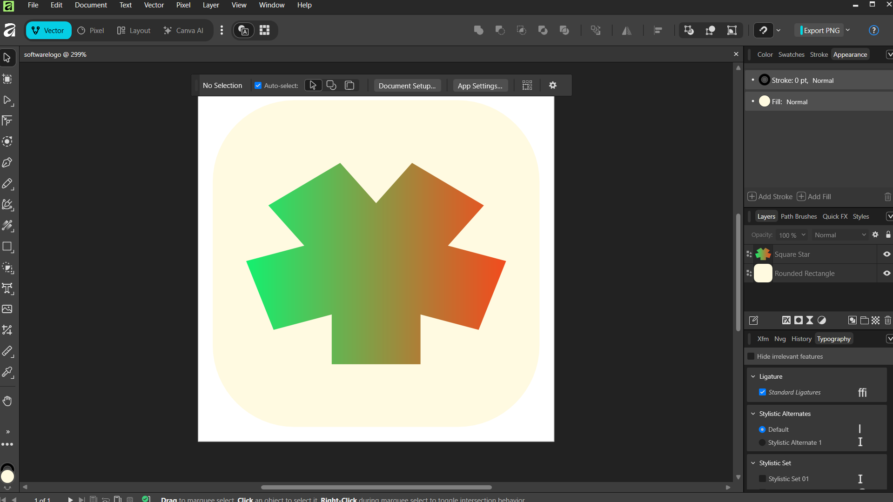

# Asset Credits

SquareStar's non-code assets do not all use the project's MIT license.

## Fonts

The bundled Outfit fonts are distributed under the SIL Open Font License 1.1. The license text is in `licenses/Outfit-OFL-1.1.txt`.

Source: [Google Fonts / Outfit](https://github.com/google/fonts/tree/main/ofl/outfit)

## Audio

| Bundled file | Source | Creator | Source license |
| --- | --- | --- | --- |
| `assets/loading.wav` | [Simple Gunshot Reverb Test.wav](https://freesound.org/people/morganpurkis/sounds/399268/) | morganpurkis | CC0 1.0 |
| `assets/key.wav` | [FUJITSU Computers Keyboard - Enter key Press Mono](https://freesound.org/people/Sadiquecat/sounds/799116/) | Sadiquecat | CC0 1.0 |
| `assets/click.wav` | [Close Book 2](https://freesound.org/people/qubodup/sounds/862316/) | qubodup | CC0 1.0 |
| `assets/loss.wav` | [ui sound 10.wav](https://freesound.org/people/nezuai/sounds/582595/) | nezuai | CC BY 4.0 |
| `assets/gain.wav` | [ui sound 11.wav](https://freesound.org/people/nezuai/sounds/582594/) | nezuai | CC BY 4.0 |
| `assets/decline.wav` | [Modern UI Decline](https://freesound.org/people/yuugfr1a/sounds/770202/) | yuugfr1a | CC0 1.0 |
| `assets/error.wav` | [Beep error 2](https://freesound.org/people/SamsterBirdies/sounds/581604/) | SamsterBirdies | CC0 1.0 |
| `assets/launch.wav` | [Retro Audio Logo](https://freesound.org/people/Breviceps/sounds/564237/) | Breviceps | CC0 1.0 |
| `assets/marketopenclose.wav` | [Weird Buttons App Game UI](https://freesound.org/people/CogFireStudios/sounds/619836/) | CogFireStudios | CC0 1.0 |
| `assets/transition.wav` | [Close Book 2](https://freesound.org/people/qubodup/sounds/862316/) | qubodup | CC0 1.0 |
| `assets/off.wav` | [beep_down.wav](https://freesound.org/people/paep3nguin/sounds/388047/) | paep3nguin | CC0 1.0 |
| `assets/on.wav` | [beep_up.wav](https://freesound.org/people/paep3nguin/sounds/388046/) | paep3nguin | CC0 1.0 |

The nezuai sounds are redistributed/adapted under CC BY 4.0; the full license text is in `licenses/CC-BY-4.0.txt`.

## Application icon

`assets/squarestar.ico` is original first-party artwork created by the SquareStar maintainer using Affinity software and is distributed under the repository's MIT license.

### Design provenance

The screenshot below shows the editable SquareStar logo artwork open in Affinity's Vector workspace during the design process. It is included as project provenance supporting the maintainer's first-party creation claim.

This design-process screenshot is documentation only and is not required to build or run SquareStar.
