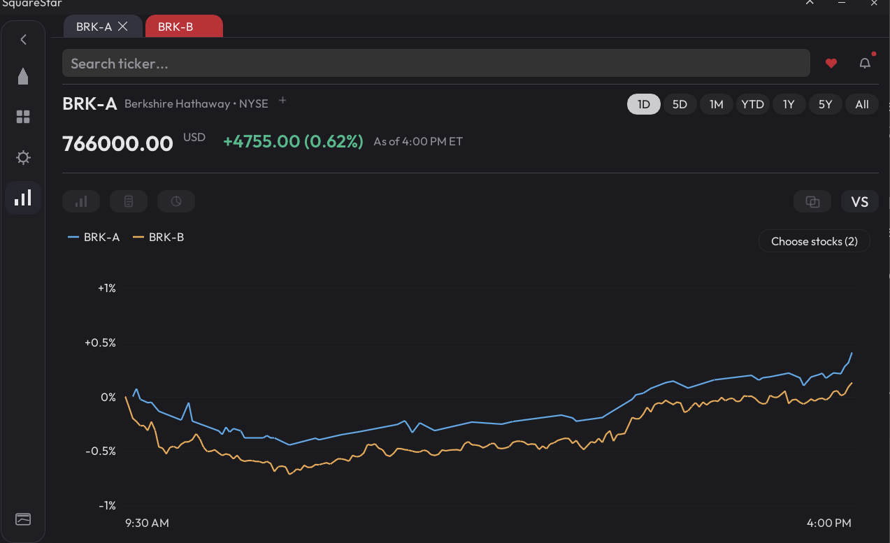
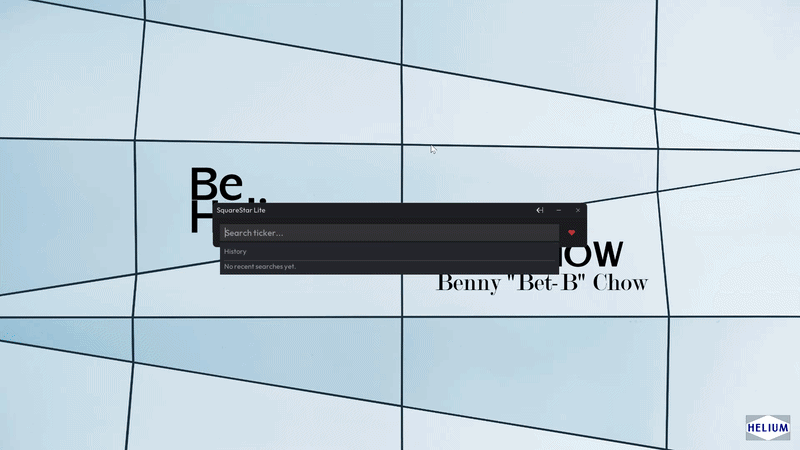
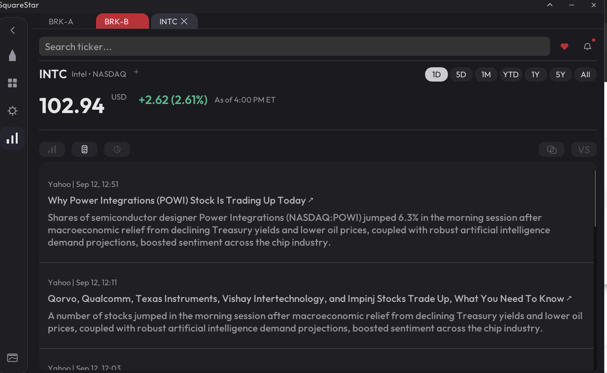
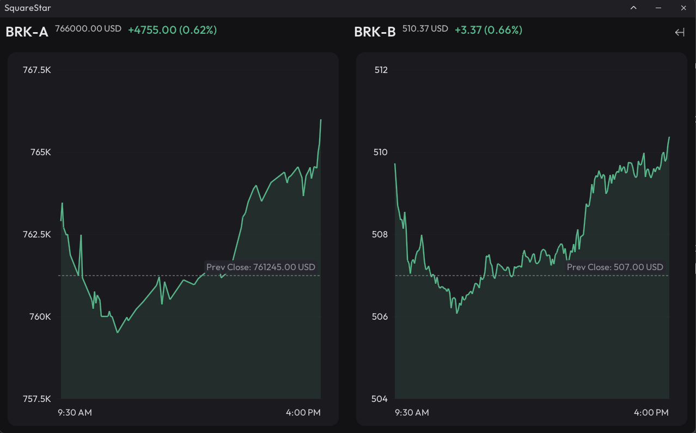
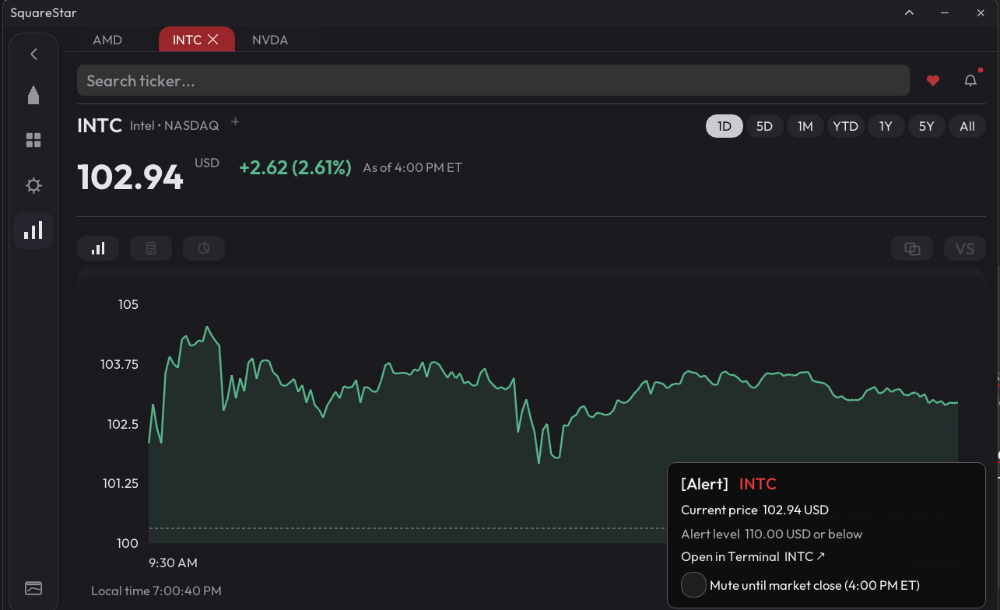

# SquareStar

SquareStar is a native C++20 market viewer for Windows. It has ticker search, charts, watchlists, screeners, comparisons, news, and price alerts without needing a browser dashboard.

**Windows x64 · C++20 · single portable EXE · MIT licensed**



## Highlights

- Direct3D 11 + GLFW + Dear ImGui + ImPlot.
- Ticker search, market overview, watchlists, comparisons, screeners, news, and company metrics.
- Interactive charts and PNG/JPEG/PDF/CSV/TXT/JSON export.
- Price alerts, desktop notifications, multi-stock monitor mode, and LiteGUI.
- No SquareStar account, installer, ads, telemetry SDK, or crash uploader.
- Settings and caches live beside the executable and are created only when needed.
- Yahoo-backed data works without a key. Finnhub is optional.

<p align="center">
  
</p>

## Screenshots

| News | Monitor mode |
| --- | --- |
|  |  |

<p align="center">
  
  <br><sub>Price alerts surface the current price, configured threshold, and a market-close mute action.</sub>
</p>

FullGUI keeps stock views on one surface with a compact ticker-tab strip. The active tab carries the close control; inactive tabs stay visually quiet so the chart remains the focus.

## Download

Windows builds are published under **GitHub Releases** as a portable `.exe` with a matching `.sha256` checksum. No installer is required; settings and cache data are stored in a `data` directory beside the executable.

The executable is currently unsigned, so Windows SmartScreen may warn on first launch.

## Build

Requirements: Windows x64, CMake 3.24+, and Visual Studio 17.x or newer C++ Build Tools, or 64-bit MinGW-w64. For MSVC, `build.cmd` bootstraps the selected Visual Studio installation with `vcvars64.bat` and pins the x64 `cl.exe` directly through Ninja or NMake when available.

```cmd
build.cmd fast
```

Before a pull request:

```cmd
build.cmd validate
```

Release package:

```cmd
build.cmd release
```

The portable components can also be built and tested with CMake + Ninja on a non-Windows machine:

```sh
cmake --preset portable-release
cmake --build --preset portable-release
ctest --preset portable-release
```

More build details are in [`docs/development/BUILDING.md`](docs/development/BUILDING.md).

## Source layout

Full GUI and LiteGUI use the same application state, market data, services, persistence, and alerts.

| Directory | Contains |
| --- | --- |
| `src/domain/` | market values and pure rules |
| `src/application/` | state, navigation, and application decisions |
| `src/services/` | providers, HTTP, parsing, persistence |
| `src/platform/` | Win32, GLFW, filesystem, audio |
| `src/presentation/` | charts, exports, formatting, layout |
| `src/modules/` | Full GUI/LiteGUI features and shell code |
| `tests/` | portable and Windows component tests |

See [`docs/architecture/ARCHITECTURE.md`](docs/architecture/ARCHITECTURE.md) for the boundaries between them.

## Performance

The main loop is event-driven: when there is no input, animation, timer, or completed background work requiring a frame, it sleeps instead of continuously redrawing.

Reference measurements from a Dell Latitude 3500 (Core i5-8265U, Windows 11, x64 `NDEBUG`/`O2`):

| Case | Result |
| --- | ---: |
| Fresh launch, left idle | 11.44 MB private bytes |
| One stock tab, idle | 12.8 MB / 0.01% CPU |
| Four stock tabs, active use | 14.77 MB / 1.14% CPU |
| LTTB, 1,000,000 -> 2,048 points | 2.501 ms median |
| Line-chart LOD, 1,000,000 points | 6.572 ms median |

These are measurements from one reference machine, not guarantees. The repository includes reproducible offline, startup, and controlled-idle benchmark commands; methodology and raw-output formats are documented in [`docs/development/PERFORMANCE.md`](docs/development/PERFORMANCE.md).

<details>
<summary>System Informer spot-check screenshots</summary>

<p align="center">
  
  <br><sub>Fresh launch, left idle — 11.44 MB private bytes.</sub>
</p>

<p align="center">
  
  <br><sub>One stock tab, idle — 0.01% CPU, 12.8 MB private bytes.</sub>
</p>

<p align="center">
  
  <br><sub>Four stock tabs open, active stock-view use — 1.14% CPU, 14.77 MB private bytes.</sub>
</p>

</details>

## Data and privacy

SquareStar is an independent client, not an official Yahoo or Finnhub product. A Finnhub key can be entered under **Settings -> Finnhub API**; no key ships with the program. Sensitive persisted state is protected with Windows DPAPI.

Market data can be delayed, incomplete, rate-limited, corrected, or changed upstream. SquareStar is a viewer, not investment advice or a trading client.

See [`PRIVACY.md`](PRIVACY.md), [`DATA_PROVIDER_NOTICE.md`](DATA_PROVIDER_NOTICE.md), and [`THIRD_PARTY_NOTICES.md`](THIRD_PARTY_NOTICES.md).

## Contributing

See [`CONTRIBUTING.md`](CONTRIBUTING.md) and run `build.cmd validate` before opening a pull request.

## License

First-party source is MIT licensed. Third-party code, fonts, audio, services, and market data keep their own licenses and terms.
